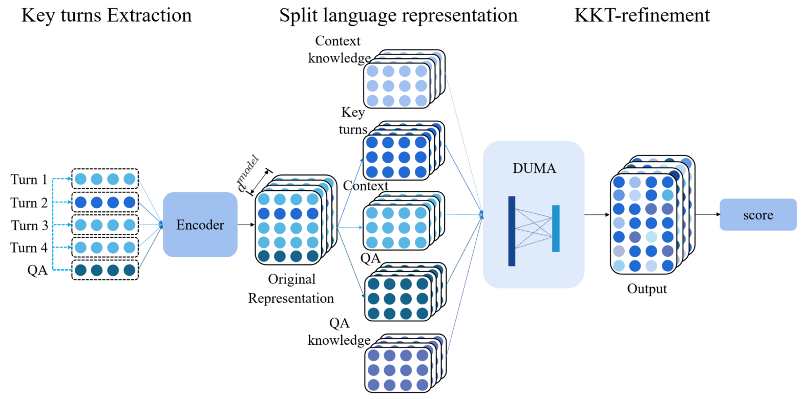

# Multi-turn Dialogue Reading Comprehension with Pivot Turns and Knowledge

Part of codes and data for the paper **[Multi-turn Dialogue Reading Comprehension with Pivot Turns and Knowledge](https://arxiv.org/abs/2102.05474)**

**KKT PART**

### **Overview**



## Requirements

(Our experiment environment for reference)

Python 3.7

PyTorch (1.0.0)

NLTK (3.4.5)

## Data

Raw data can be downloaded from the following urls:

​	DREAM: https://github.com/nlpdata/dream

​	ConceptNet: https://s3.amazonaws.com/conceptnet/downloads/2018/edges/conceptnet-assertions-5.6.0.csv.gz

We provides a processed version of DREAM and ConceptNet used in our experiment.

DREAM: in .KKT_code/dream_data/

​	We have written the relevance score and rank of each turn corresponding to QA in the json file.

​	We also have written the related knowledge IDs in ConceptNet for each example in the json file.             

ConceptNet: in .KKT_code/conceptnet/

​	We have made a smaller version of ConceptNet, which only contains the English part.

## Instructions

Here is a simple example of our experiment:

1. Get knowledge representation

```shell
python get_knowledge_representation.py 
--data_dir=../conceptnet/ 
--model_type=albert 
--model_name_or_path=albert-xxlarge-v2 
--task_name=knowledge 
--max_seq_length=40 
--do_lower_case 
--per_gpu_eval_batch_size=256
```

​	2. Run the model

```bash
python run_multiple_choice.py 
--data_dir=../dream_data 
--model_type=albert_all 
--model_mode=kp 
--model_name_or_path=albert-xxlarge-v2 
--knowledge_file=../conceptnet/albert-xxlarge-v2_concept_knowledge_representations 
--task_name=dream 
--output_dir=../results/albert_xxlarge_dream 
--warmup_steps=0
--max_seq_length=512 
--top_k=6 
--do_train 
--do_eval 
--do_test 
--do_lower_case 
--per_gpu_train_batch_size=2 
--per_gpu_eval_batch_size=16 
--learning_rate=1e-5 
--num_train_epochs=2 
--save_steps=383 
--max_contexts_knowledge=30 
--eval_all_checkpoints 
--overwrite_output_dir 
--overwrite_cache
```

The results will be saved in ./results/albert_xxlarge_dream/my_eval_results.txt

Please kindly cite this paper if you use this repo.

```bash
@article{DBLP:journals/corr/abs-2102-05474,
  author    = {Zhuosheng Zhang and
               Junlong Li and
               Hai Zhao},
  title     = {Multi-turn Dialogue Reading Comprehension with Pivot Turns and Knowledge},
  journal   = {CoRR},
  volume    = {abs/2102.05474},
  year      = {2021},
  url       = {https://arxiv.org/abs/2102.05474},
  archivePrefix = {arXiv},
  eprint    = {2102.05474},
  timestamp = {Thu, 18 Feb 2021 15:26:00 +0100},
  biburl    = {https://dblp.org/rec/journals/corr/abs-2102-05474.bib},
  bibsource = {dblp computer science bibliography, https://dblp.org}
}
```bash
